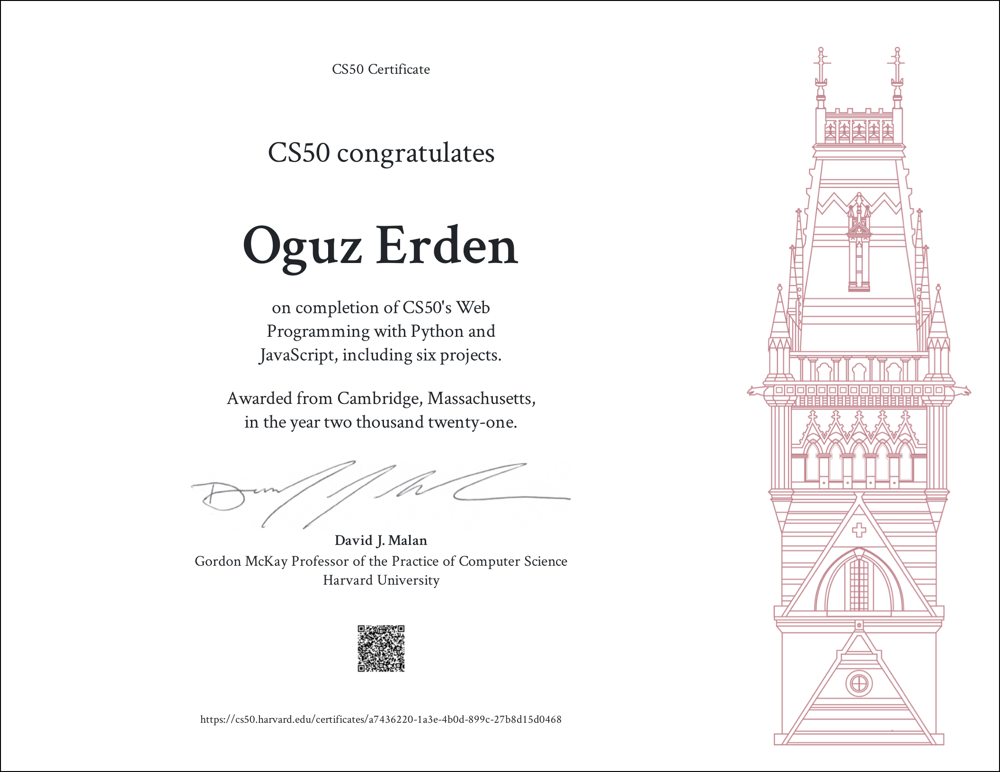
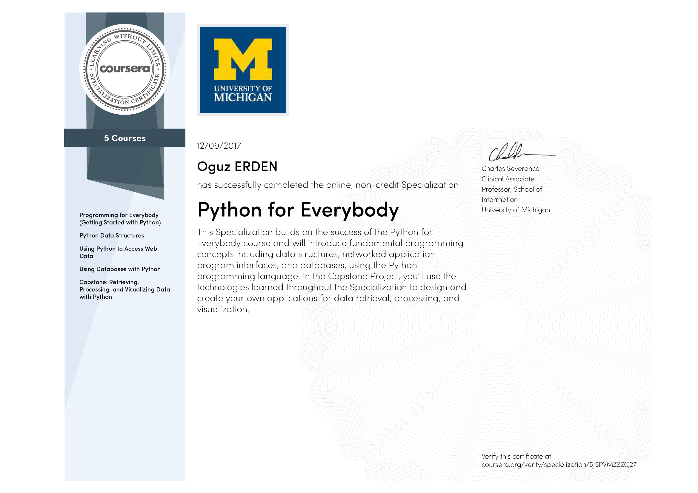
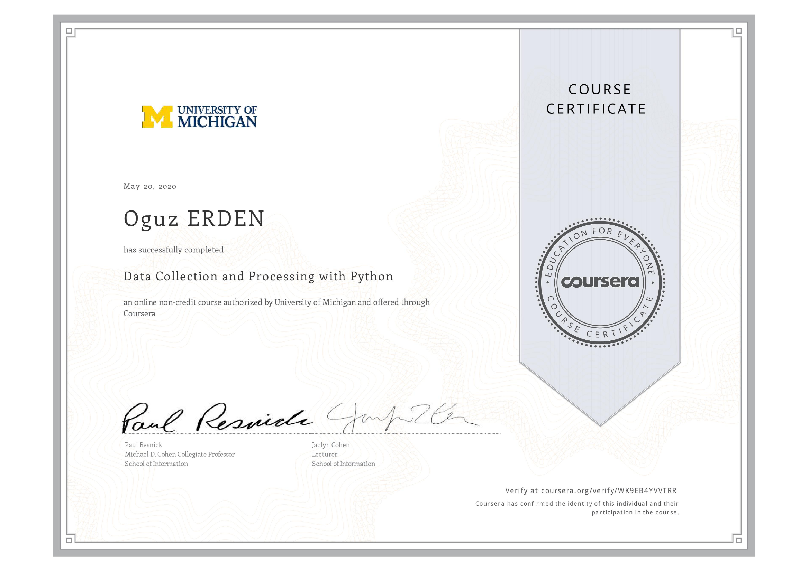
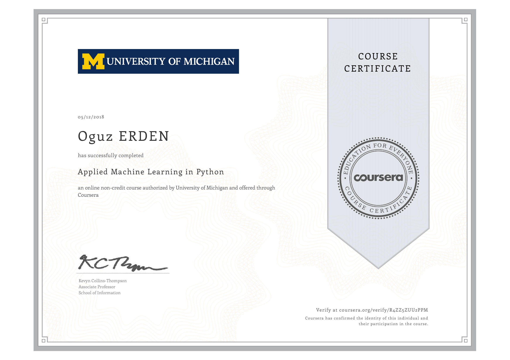
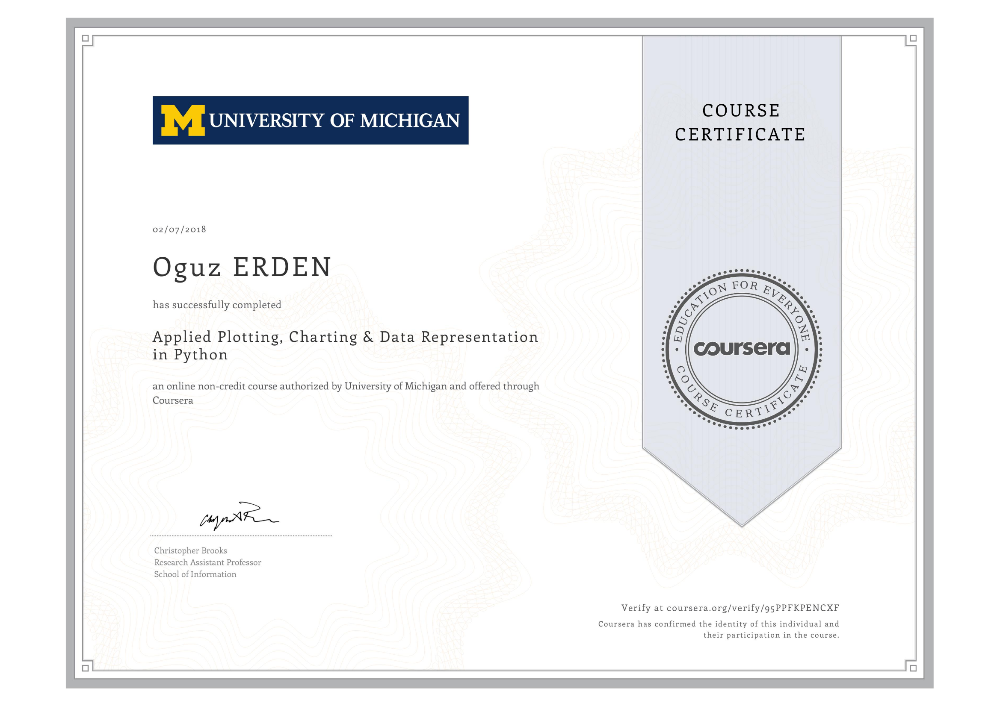
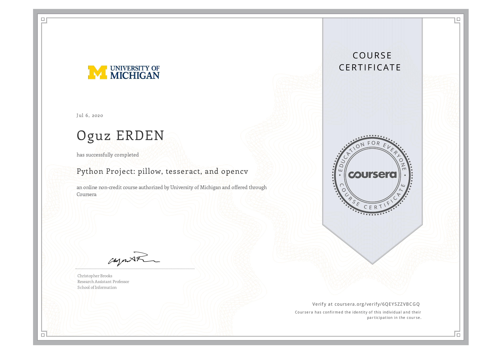

### Hi, I'm Oguz!

I love creating things and meeting new people.

I'm a creative thinker, Python ethusiast, traveller and amateur photographer. 
I'm doing my master on Data Science field.
I'm Seeking to be inspired, to envision the unlikely, to work hard for things that are worth it, and to be surrounded by those who bring out the best in me.

I like playing with data. 
I love structure and order and I also stand for quality. I love spending time on fixing little details and finding the best solution. Also I like working in a team.

I'm using HTML, CSS and Python, React for web development. Pandas for data analysis, and Sckit-Learn for Machine Learning.

### Here you can see some of my certificates:

